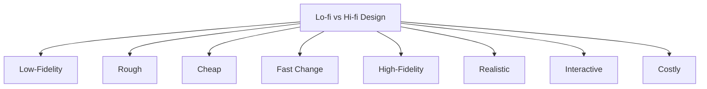

# Lo-fi vs Hi-fi Design

| Aspect | Low-Fidelity (Lo-fi) | High-Fidelity (Hi-fi) |
|----------|---------------------|----------------------|
| Appearance | Rough and simple | Closely resembles final product |
| Materials | Paper, sketches, cards, storyboards | Actual software and hardware components |
| Development Time | Quick to create | Time-consuming to create |
| Cost | Low | Higher |
| Ease of Modification | Very easy to change | More difficult to modify |
| Functionality | Limited or simulated | More realistic and interactive |
| Level of Detail | Basic layout and concepts | Detailed interface and interactions |
| Purpose | Explore ideas and concepts | Evaluate detailed design and usability |
| Design Stage | Early stages of development | Later stages of development |
| User Focus | Functionality and workflow | Realistic user experience |
| Examples | Sketches, wireframes, storyboards, index cards | Clickable apps, interactive websites, software prototypes |
| Main Advantage | Fast and inexpensive iteration | Realistic testing and evaluation |
| Main Limitation | Limited realism | Greater cost and development effort |

