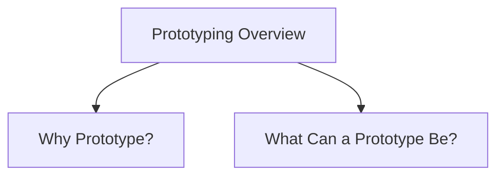

# Prototyping Overview

Prototyping is the process of creating representations of a design so that stakeholders can interact with, evaluate, and discuss ideas before a final product is built.

A prototype is one manifestation of a design that allows stakeholders to experience aspects of the system and provide feedback. Prototypes can vary from simple sketches to software systems that closely resemble the final product.

Prototyping is a central activity in interaction design because evaluation and feedback are essential throughout the design process. It helps designers explore ideas, communicate concepts, test alternatives, and identify problems early.

## Why Prototype?

Prototypes help to:

- Support evaluation and feedback
- Allow stakeholders to see, hold, and interact with design ideas
- Improve communication among team members
- Test concepts before implementation
- Encourage reflection and discussion
- Compare alternative designs
- Answer design questions before development begins

## What Can a Prototype Be?

In interaction design, a prototype can take many forms, including:

- Screen sketches
- Storyboards
- PowerPoint presentations
- Videos simulating system use
- Physical models
- Electronic mock-ups
- Animations
- Software with limited functionality
