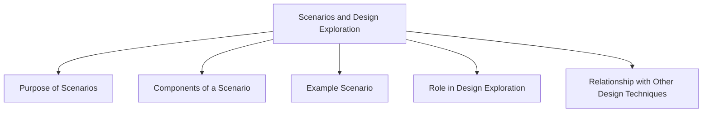

# Scenarios and Design Exploration

Scenarios are narrative descriptions of how users might interact with a product in a particular situation to achieve a goal. They help designers understand user needs, explore design ideas, and evaluate alternative solutions.

Scenarios focus on users, their goals, the context of use, and the sequence of actions performed while interacting with a system.

In interaction design, scenarios are often used alongside prototypes and storyboards to explore and refine design concepts.

## Purpose of Scenarios

Scenarios help designers:

- Understand user goals and needs
- Explore alternative design solutions
- Visualize how a product will be used
- Identify potential usability issues
- Support communication among stakeholders
- Evaluate design ideas before implementation

## Components of a Scenario

A scenario typically includes:

| Component | Description |
|------------|-------------|
| User | The person interacting with the system |
| Goal | What the user wants to achieve |
| Context | The situation or environment |
| Actions | Steps performed by the user |
| Outcome | Result of the interaction |

## Example Scenario

### Food Delivery App

**User:** Ali

**Goal:** Order food during a short break.

**Scenario:**

Ali has a 30-minute break and feels hungry. He opens a food delivery application on his phone and browses nearby restaurants. After finding a burger meal he likes, he places an order. The application confirms the order and displays an estimated delivery time of 20 minutes.

## Role in Design Exploration

Scenarios are used to explore different ways a system could support users.

Designers can:

- Compare alternative designs
- Test different workflows
- Identify missing functionality
- Generate ideas for prototypes and wireframes

## Relationship with Other Design Techniques

| Technique | Purpose |
|------------|---------|
| Scenario | Describes a user story and task flow |
| Storyboard | Visualizes a scenario through sketches |
| Wireframe | Shows the interface structure |
| Prototype | Allows interaction with the design |

Scenarios provide the context for design exploration, while storyboards and prototypes help transform those scenarios into concrete design solutions.
