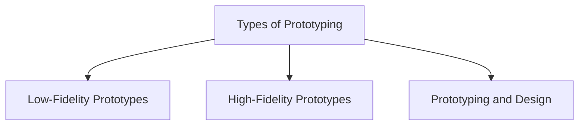

# Types of Prototyping

Prototypes are commonly categorized as:

## Low-Fidelity Prototypes

Simple representations created using materials that differ from the final product, such as:

- Paper sketches
- Storyboards
- Index cards
- Wizard-of-Oz prototypes

Characteristics:

- Quick to create
- Low cost
- Easy to modify
- Useful during early design stages

## High-Fidelity Prototypes

Prototypes that closely resemble the final system and often use the same technologies.

Characteristics:

- More realistic appearance and interaction
- Uses actual software or hardware components
- Supports detailed testing and evaluation
- Requires more time and effort to develop

## Prototyping and Design

Prototyping supports both conceptual and concrete design by helping designers explore ideas, understand user needs, and refine solutions before construction begins.
