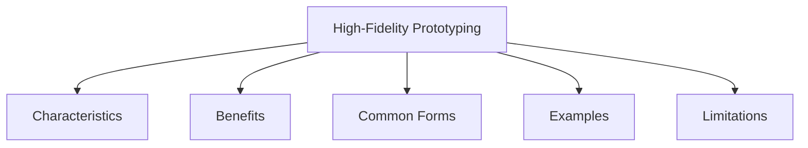

# High-Fidelity Prototyping

High-fidelity prototyping is a prototyping approach that uses materials, technologies, and interactions that closely resemble those of the final product.

Unlike low-fidelity prototypes, high-fidelity prototypes look and behave much more like the finished system. They often use actual software, hardware, or interface components, allowing users to experience a more realistic version of the design.

High-fidelity prototypes can be created by integrating existing hardware and software components to simulate the intended product.

## Characteristics

- Closely resembles the final product
- Provides realistic interaction and appearance
- Uses actual software or hardware technologies
- Supports detailed usability testing
- Requires more time and resources to develop
- More difficult to modify than low-fidelity prototypes

## Benefits

- Provides realistic user experiences
- Enables detailed evaluation of interactions
- Helps identify usability issues before development is completed
- Demonstrates functionality to stakeholders
- Improves communication between designers, developers, and users

## Common Forms

- Interactive software prototypes
- Clickable mobile app prototypes
- Functional website prototypes
- Hardware mock-ups with working components
- Interactive animations and simulations

## Examples

### Mobile Banking App

A prototype includes:

- Realistic screens
- Working navigation
- Interactive buttons
- Simulated account information

Users can perform tasks such as checking balances or transferring money as if using the final application.

### E-Commerce Website

A prototype allows users to:

- Browse products
- Search for items
- Add products to a cart
- Navigate through checkout screens

Although payment processing may not be fully implemented, the interaction closely resembles the final website.

### Smart Device Prototype

A prototype smartwatch includes:

- Functional touch interface
- Interactive menus
- Simulated notifications
- Working navigation controls

Users can test how the device feels and operates before production.

## Limitations

- More expensive to create
- Requires additional development effort
- Changes can be time-consuming
- Users may mistakenly believe the prototype is a complete product

Because of its realistic appearance and behavior, stakeholders may overlook missing functionality or assume the system is fully developed. Therefore, it is important to communicate that a prototype is still an unfinished design.

High-fidelity prototypes are typically used after major design decisions have been made and when detailed evaluation of the user experience is required.
