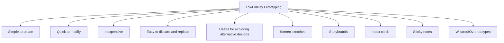

# Low-Fidelity Prototyping

Low-fidelity prototyping is an early-stage prototyping approach that uses materials and representations that are different from the final product. Instead of creating a working system, designers use simple and inexpensive methods to explore ideas and gather feedback.

The main purpose of low-fidelity prototypes is to test concepts, workflows, and interactions before investing significant time and resources in development.

Low-fidelity prototypes are:

- Simple to create
- Quick to modify
- Inexpensive
- Easy to discard and replace
- Useful for exploring alternative designs

Because they are rough and unfinished, stakeholders tend to focus on functionality and design ideas rather than visual appearance.

Common forms of low-fidelity prototypes include:

- Screen sketches
- Storyboards
- Index cards
- Sticky notes
- Wizard-of-Oz prototypes

Low-fidelity prototyping is most useful during the early stages of design when requirements are still being explored and design ideas are changing frequently.
