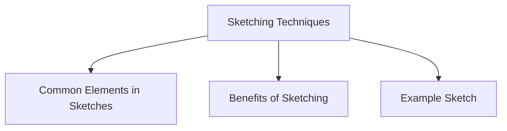

# Sketching Techniques

Sketching is one of the most common techniques used in low-fidelity prototyping. It involves creating simple drawings that represent screens, interfaces, interactions, or design ideas.

The purpose of sketching is to explore and communicate ideas quickly without spending time on detailed visual design or implementation.

Low-fidelity prototypes often rely heavily on sketching because sketches are:

- Fast to create
- Easy to modify
- Low cost
- Effective for brainstorming
- Useful for discussing alternative designs

Designers do not need advanced drawing skills to create effective sketches. Simple shapes, symbols, and labels are usually sufficient to represent interface elements and interactions.



## Common Elements in Sketches

- Rectangles for screens or windows
- Boxes for buttons and input fields
- Lines for text
- Arrows to show navigation or user flow
- Simple icons and symbols
- Labels to describe functionality

## Benefits of Sketching

- Encourages creativity and experimentation
- Supports rapid idea generation
- Makes design changes easy
- Helps communicate concepts to stakeholders
- Focuses attention on functionality rather than appearance

## Example Sketch

### Mobile Login Screen

```text
+------------------+
|     LOGO         |
|                  |
| Username ______  |
| Password ______  |
|                  |
| [ Login ]        |
|                  |
| Forgot Password? |
+------------------+
```

### Food Delivery App Home Screen

```text
+------------------------+
| Search Restaurants 🔍 |
+------------------------+

 Order Again
+------+ +------+ +------+
|Burger| |Pizza | |Fries |
+------+ +------+ +------+

 Categories
🍔  🍕  🍣  ☕
```

Sketches are intentionally simple and rough so that designers can focus on ideas, interactions, and user needs rather than visual details.
