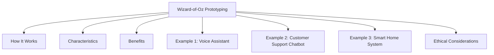

# Wizard-of-Oz Prototyping

Wizard-of-Oz (WoZ) prototyping is a low-fidelity prototyping technique in which users believe they are interacting with a computer system, but some or all of the system's responses are actually generated by a human behind the scenes.

The person controlling the system is known as the "wizard." The wizard observes the user's actions and manually provides responses that simulate the behavior of the intended system.

This technique is commonly used during the early stages of design to understand user expectations and evaluate interactions before developing complex functionality.



## How It Works

1. The user interacts with what appears to be a working system.
2. A hidden human operator monitors the interaction.
3. The operator manually generates responses that imitate system behavior.
4. The user experiences the interaction as if it were automated.
5. Designers observe the interaction and collect feedback.

## Characteristics

- Used in early design stages
- Simulates functionality that has not yet been implemented
- Requires minimal development effort
- Helps evaluate user expectations
- Supports rapid testing of design ideas

## Benefits

- Test concepts before building them
- Explore complex interactions cheaply
- Identify user needs and expectations
- Gather feedback on proposed features
- Reduce development risks

## Example 1: Voice Assistant

A user speaks commands to a prototype voice assistant.

```text
User: "What's the weather today?"

(Hidden human hears the request)

System: "Today's temperature is 28°C with clear skies."
```

The user believes an AI system generated the response, while a human actually provided it.

## Example 2: Customer Support Chatbot

A prototype chatbot appears on a website.

```text
User: "How can I track my order?"

(Hidden operator types a response)

Chatbot: "You can track your order using the tracking link sent to your email."
```

The interaction appears automated even though a human is controlling the responses.

## Example 3: Smart Home System

A user presses a button in a prototype smart home application to turn on lights.

Instead of an actual automation system controlling the lights, a hidden operator manually switches the lights on, creating the illusion of a functioning smart home system.

## Ethical Considerations

Because users may not know that a human is controlling the system, designers must consider:

- Transparency and informed consent
- User privacy
- Data handling and confidentiality
- Avoiding deception beyond what is necessary for the study

Wizard-of-Oz prototyping allows designers to evaluate interactions and user expectations long before the actual technology is fully developed.
